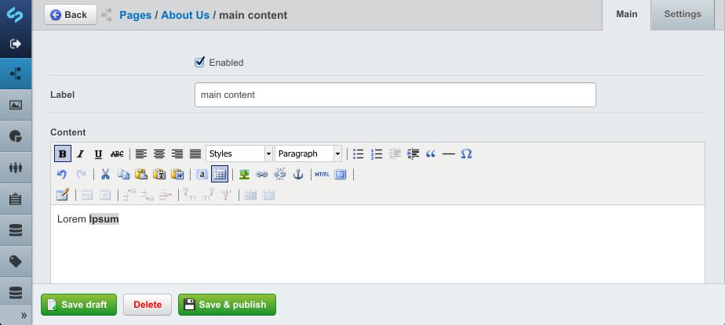

# SilverStripe Elemental

## Introduction

This module extends a page type to swap the content area for a GridField and manageable elements (widgets) to compose
a page out of rather than a single text field.

Versioning and search indexing are supported out of the box.

The module provides basic markup for each of the widgets but you will likely need to provide your own styles. Replace
the `$Content` variable with `$ElementArea` and rely on the markup of the individual widgets.

## Installation

	composer require "dnadesign/silverstripe-elemental" "dev-master"

Extend any page type with the ElementPageExtension and define allowed elements. This can be done via the SilverStripe
`YAML` config API

**mysite/_config/app.yml**

	Page:
	  extensions:
	    - ElementPageExtension


## Requirements

- Silverstripe 3.1
- [ajshort/silverstripe-gridfieldextensions](https://github.com/ajshort/silverstripe-gridfieldextensions)
- [ajshort/silverstripe-addressable](https://github.com/ajshort/silverstripe-addressable)
- [undefinedoffset/sortablegridfield](https://github.com/UndefinedOffset/SortableGridField)

## Configuration

### Limit Allowed Elements

You may wish to only enable certain elements for the CMS authors to choose from rather than the full set.

````
	Page:
	  allowed_elements:
		- 'ElementContent'

````

By default, an Element List can contain nested Elements. To set allowed elements in list use the `allowed_elements`
flag.

````

	ElementList:
	  allowed_elements:
	    'ElementFile' : 'File'

````

Extra CSS classes can be configure in the `YAML` config file. By default, the Image element comes with 3 optional
classes:

````
	ElementImage:
	  css_styles:
	    - 'image_large' : 'Large'
	    - 'image_medium' : 'Normal'
	    - 'image_small' : 'Small'
````

### Defining your own elements.

An element is as simple as a class which extends `BaseElement`. After you add the class, ensure you have rebuilt your
database and reload the CMS.

	<?php

	class MyElement extends BaseElement {

		private static $title = "My Element";

		private static $description = "My Custom Element";

		public function getCMSFields() {
			// ...
		}
	}

MyElement will be rendered into a `MyElement.ss` template.

### Screenshots



