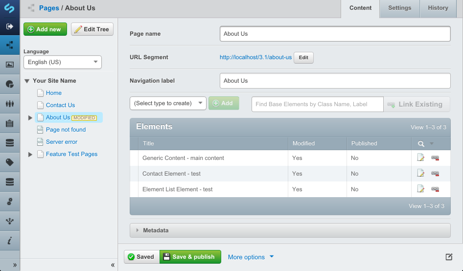

# SilverStripe Elemental

[](https://travis-ci.org/dnadesign/silverstripe-elemental)
[](https://scrutinizer-ci.com/g/dnadesign/silverstripe-elemental/?branch=master)
[](https://codecov.io/gh/dnadesign/silverstripe-elemental)
[](https://packagist.org/packages/dnadesign/silverstripe-elemental)
[](LICENSE.md)

## Introduction

This module extends a page type to swap the content area for a GridField and manageable elements to compose a page out
of rather than a single text field. Features supported:

* Versioning of elements
* Ability to add, remove supported elements per page.

The module provides basic markup for each of the elements but you will likely need to provide your own styles. Replace
the `$Content` variable with `$ElementArea` and rely on the markup of the individual elements.

## Installation

```
composer require "dnadesign/silverstripe-elemental" "dev-master"
```

Extend any page type with the ElementPageExtension and define allowed elements. This can be done via the SilverStripe
`YAML` config API.

**mysite/\_config/app.yml**

```yaml
ElementPage:
  extensions:
    - DNADesign\Elemental\Extensions\ElementalPageExtension
```

In your page type template use `$ElementArea` to render the elements to the page.

## Configuration

### Customize HTML and Markup

The basic element area is rendered into the standard `ElementArea` template. This loops over each of the element
controller instances. Each controller instance will render `$ElementHolder` which represented the element contained within
a holder `div`. The wrapper div is the `ElementHolder.ss` template.

### Limit Allowed Elements

You may wish to only enable certain elements for the CMS authors to choose from rather than the full set.

```yaml
ElementPage:
  allowed_elements:
    - DNADesign\Elemental\Models\ElementContent
```

Likewise, you can exclude certain elements from being used.

```yaml
ElementPage:
  disallowed_elements:
    - YourCompany\YourModule\Elements\ElementContact
```

### Limiting Global Elements

By default any element is available to be linked to multiple pages. This can be
changed with the "Available globally" checkbox in the settings tab of each element.
The default can be changed so that global elements are opt-in:

```yaml
DNADesign\Elemental\Models\BaseElement:
  default_global_elements: false
```

### Defining your own Elements.

An element is as simple as a class which extends `BaseElement`. After you add the class, ensure you have rebuilt your
database and reload the CMS.

```php
<?php

use DNADesign\Elemental\Models\BaseElement;

class MyElement extends BaseElement
{
    private static $title = "My Element";

    private static $description = "My Custom Element";

	public function getCMSFields()
    {
        $fields = parent::getCMSFields();

        // ...

        return $fields;
    }
}
```

### Defining your own HTML

`MyElement` will be rendered into a `MyElement.ss` template with the `ElementHolder.ss` wrapper. Changing the holder
template can be done via `YAML` or using a `$controller_template` on your subclass.

```php
private static $controller_template = 'MyElementHolder';
```

To customise existing block templates such as `Content` and `Form` templates copy the relevant files from
`vendor/dnadesign/silverstripe-elemental/templates` to your theme.

### Style Variants

Via YAML you can configure a whitelist of style variants for each `BaseElement` subclass. For instance, if you have
`dark` and `light` variations of your content block you would enter the following in YAML in the format
(class: 'Description'). The class will be added to the `ElementHolder`.

```yml
DNADesign\Elemental\Models\ElementContent:
  styles:
    light: 'Light Background'
    dark: 'Dark Background'
```

### Implementing search

Composing your page of elements means that searching the page for content will require you to add some additional logic
as SilverStripe would normally expect content to live in a single `Content` field. By default, elemental will copy all
elements into the `$Content` field on save so search works as designed however this has one limitation, if you share
elements between pages, publishing on page A will not update the searched content on page B.

To get around this, we can use the `ElementalSolrIndexer` class (given you're using the
[FulltextSearchable module](https://github.com/silverstripe-labs/silverstripe-fulltextsearch)). This class can help add
some smarts to the Solr indexing so that it understands our content.

First step is to define a custom Solr index

```php
<?php

class CustomSolrSearchIndex extends SolrSearchIndex
{
    public function getFieldDefinitions()
    {
        $xml = parent::getFieldDefinitions();

        // adds any required XML configuration
        $indexer = new ElementalSolrIndexer();
        $xml = $indexer->updateFieldDefinition($xml);

        return $xml;
    }

    protected function _addAs($object, $base, $options)
    {
        // boiler plate from parent::_addAd since we can't
        // call the parent function to modify this document.

        $includeSubs = $options['include_children'];

        $doc = new Apache_Solr_Document();
        $doc->setField('_documentid', $this->getDocumentID($object, $base, $includeSubs));
        $doc->setField('ID', $object->ID);
        $doc->setField('ClassName', $object->ClassName);

        foreach (SearchIntrospection::hierarchy(get_class($object), false) as $class) {
            $doc->addField('ClassHierarchy', $class);
        }

        foreach ($this->getFieldsIterator() as $name => $field) {
            if ($field['base'] == $base) {
                $this->_addField($doc, $object, $field);
            }
        }

        // custom code for adding in the Elemental smarts
        $indexer = new ElementalSolrIndexer();
        $indexer->elementPageChanged($object, $doc);


        try {
            $this->getService()->addDocument($doc);
        } catch (Exception $e) {
            SS_Log::log($e, SS_Log::WARN);
            return false;
        }

        return $doc;
    }
}
```

After setting up your SolrSearchIndex, run `sake dev/tasks/Solr_Configure`.

## Screenshots



## Versioning

This library follows [Semver](http://semver.org). According to Semver, you will be able to upgrade to any minor or patch version of this library without any breaking changes to the public API. Semver also requires that we clearly define the public API for this library.

All methods, with `public` visibility, are part of the public API. All other methods are not part of the public API. Where possible, we'll try to keep `protected` methods backwards-compatible in minor/patch versions, but if you're overriding methods then please test your work before upgrading.

## Reporting Issues

Please [create an issue](http://github.com/dnadesign/silverstripe-elemental/issues) for any bugs you've found, or features you're missing.

## Credits

CMS Icon blocks by Creative Stall from the Noun Project
