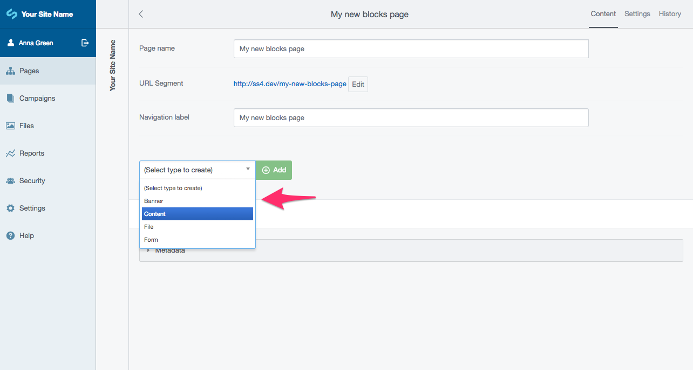
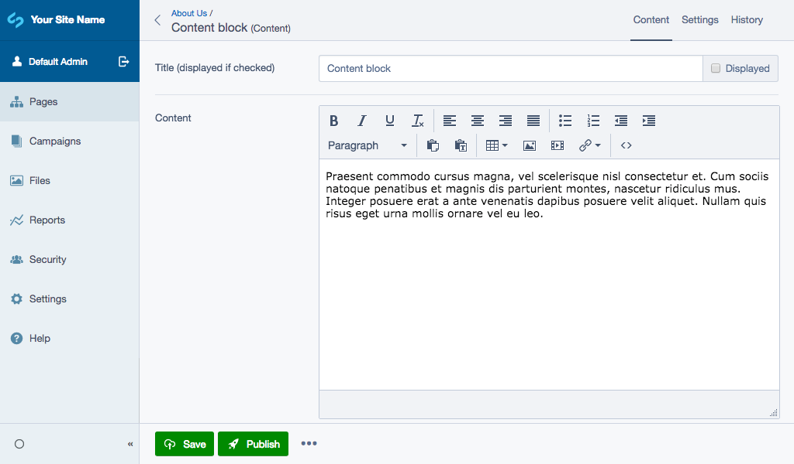
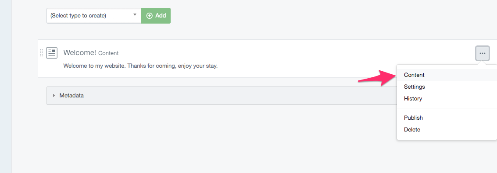

# Creating and editing content

To get started, create a new page in the CMS. For more information on this, see the "Creating pages and content"
section of the [user help documentation](https://userhelp.silverstripe.org).

## Creating new blocks

Normally in the CMS a page has a Content field which allows you to enter content directly. You will notice now that
the Content field has been replaced with a list of content blocks. This list will be empty until you have added
some blocks, so let's do this now.

To get started, choose the type of block you want to create from the "Select type to create" dropdown field, and click
"Add":

From here you will be taken to edit the content for the new block. If you've used the SilverStripe CMS in the past, you
will be familiar with the Content editor you are shown. Enter your content as required, provide a title for the block
and choose whether you want the title to be shown on the frontend or not via the "Displayed" checkbox.

When you are finished, click "Save" to save the content and you will be safe to return back to your new page.

## Editing existing blocks

Editing an existing block is the same process as creating a new one, only you click on the block you want to edit
instead of choosing a type and selecting "Add" to create a new one.

When viewing a page, aside from clicking on a content block that you want to edit, you can also select "Content" from
the "more actions" dropdown list at the right hand side:

