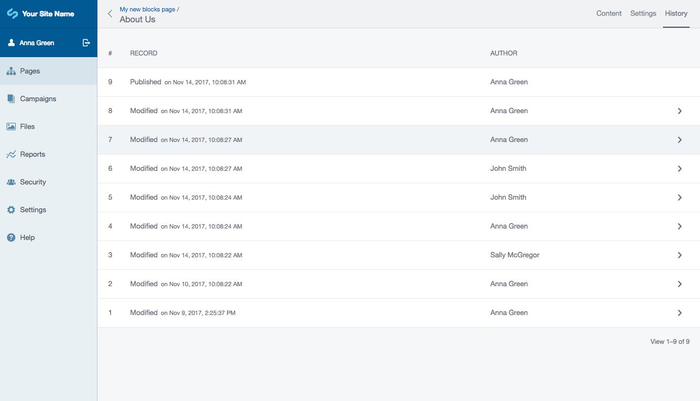
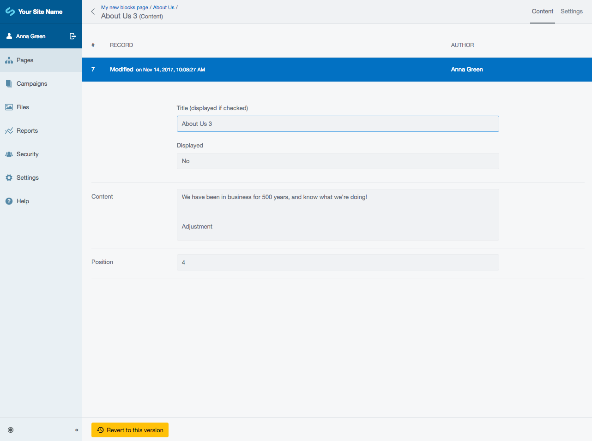
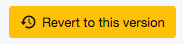
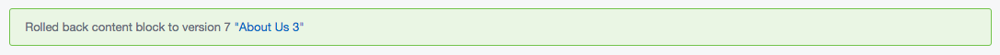

# Using block history

## Finding historic versions of content

Whenever you modify a block and save it, a new version of the block is created and the old version is saved in a
history archive. You can view this archive from the "History" tab of any block, which will show you a list of each
version, the date it was modified or published and the user who actioned the change.

You can click on a specific version from the list to see a reference of what that block looked like at that version:

## Rolling back to specific versions

If you want to revert a content block back to an old version, simply choose the version you want from the list and
click on the "Revert to this version" button at the bottom:

You will then see a success message:

Doing this will create a new draft version of the block with the old content in it. You will need to publish the
new content for it to be visible on the frontend website.
