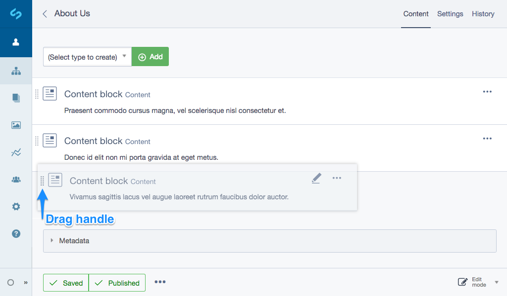

# Reordering content blocks

To change the order of content blocks in a page, simply click and hold on the drag icon at the left hand side of a
block row, then drag and release to reorder items:

When you release your mouse the blocks will automatically save their new positions, however you may need to publish
the page to see the new order in the frontend website.
