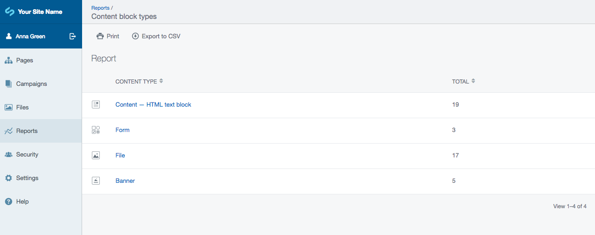
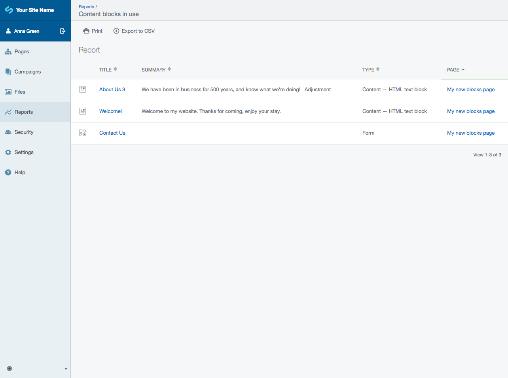
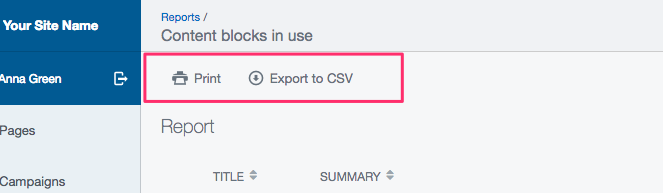

# Use the reports

The [Elemental module](https://addons.silverstripe.org/add-ons/dnadesign/silverstripe-elemental) adds some new
reports to the "Reports" section of the CMS. These will allow you to identify and find content in blocks quickly.

## Content block types

This report will list all types of content blocks in your system, as well as how many times they have been
used to create content.

You can find this by navigating to "Reports" and choosing "Content block types" from the list:

You can click on a content block type to go to the "content blocks in use" report, filtered by this type of block.

## Content blocks in use

Here you will be shown a more detailed overview of the content blocks in your system, which type they are and
which page they were created on.

Click on any block title, or page name to go to edit the block.

## Printing and exporting

For any SilverStripe report you can select either "Print" or "Export to CSV" to save or export your report data:

