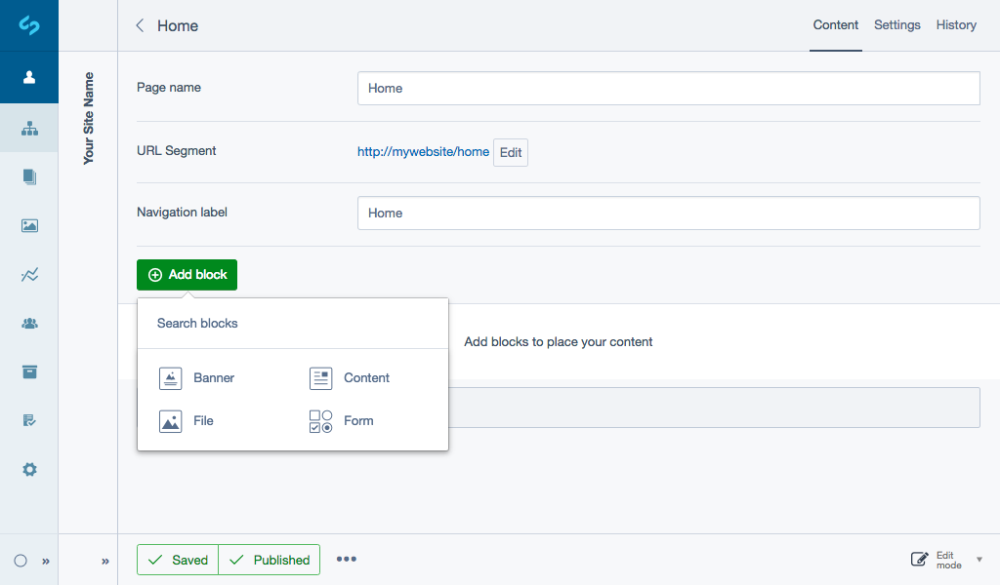

# Creating and editing content

To get started, create a new page in the CMS. For more information, see [Pages and content](https://userhelp.silverstripe.org) User help guide, to learn more.

## Creating new blocks

Normally in the CMS a page has an HTML editor which allows you to enter content directly.
You will notice that the HTML editor has been replaced with an empty list and a content block ***Select type to create*** dropdown field.

The block types shown in the dropdown field will depend on your set up. By default the [Elemental module](https://github.com/dnadesign/silverstripe-elemental) only comes with the content block type, **Content**.

We’ve created the most functional and effective elements of content block modules that have been developed by the SilverStripe community and created four generic SilverStripe supported content block types:

* [Content:](https://github.com/dnadesign/silverstripe-elemental) text content (built-in).
* [Banner:](https://github.com/silverstripe/silverstripe-elemental-bannerblock) banner with call-to-action and content.
* [File:](https://github.com/silverstripe/silverstripe-elemental-fileblock) file and image block.
* [Form:](https://github.com/dnadesign/silverstripe-elemental-userforms) integrates [silverstripe-userforms](silverstripe/silverstripe-userforms) and provides a new content block, which can be used to create user defined forms.

For examples of community content blocks see,
[Getting more elements](https://github.com/dnadesign/silverstripe-elemental#getting-more-elements).

To get started, choose the type of block you want to create from the ***Select type to create*** dropdown field, and click the button ***Add***.

From here you will be navigated away to edit the content for the new block. Enter your content as required, provide a title for the block and choose whether you want the title to be shown on the front-end or not via the ***Displayed*** checkbox field.

When you are finished, click the button ***Save***.

## Editing existing blocks

When viewing a page, you can select the content block list item or select **Content** from the ***More actions*** dropdown shown as an ellipses icon.

# Reordering content blocks

To change the order of content blocks in a page, simply click and hold on the drag handle icon on the left hand side of a block list item, then drag and release to reorder the item.

When you release your mouse the blocks will automatically save their new positions, however you may need to publish
the page to see the new order in the front-end of your website.
