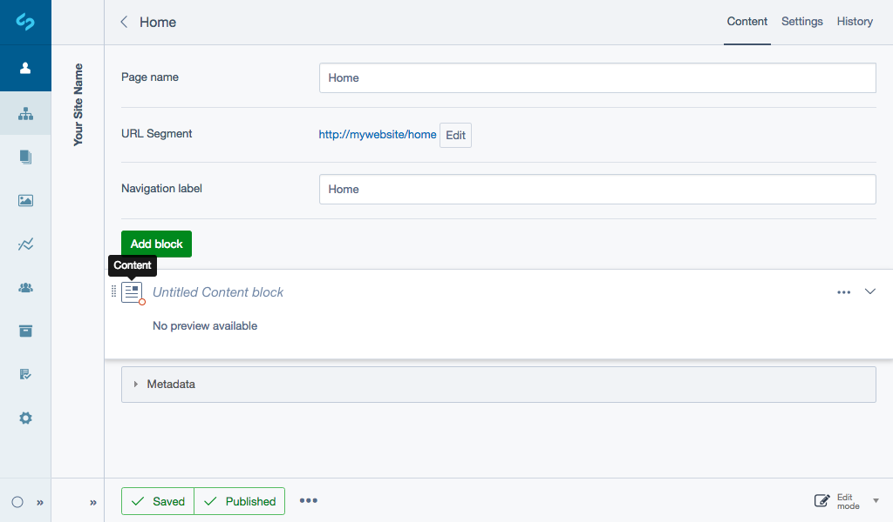
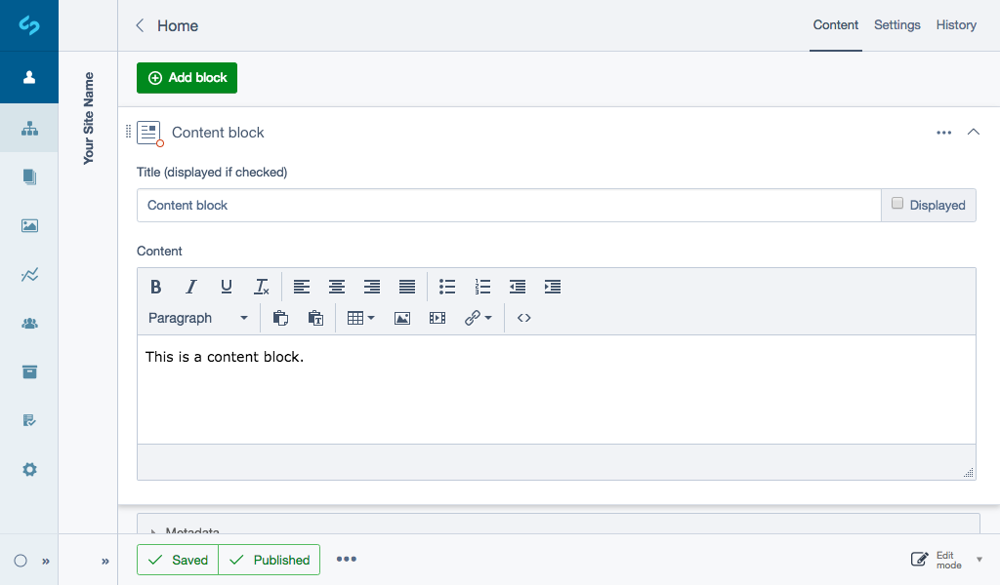
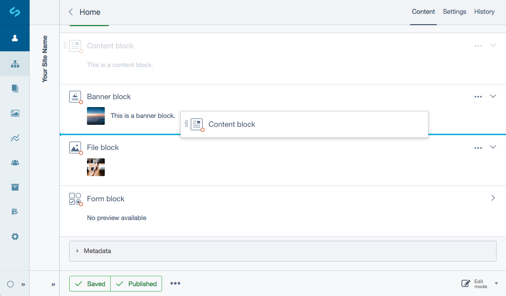
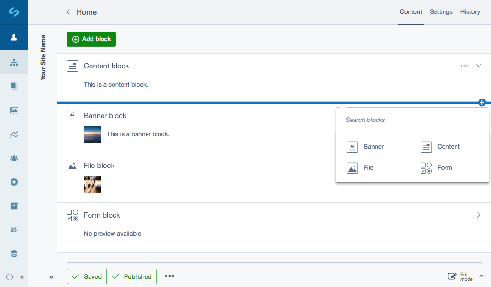
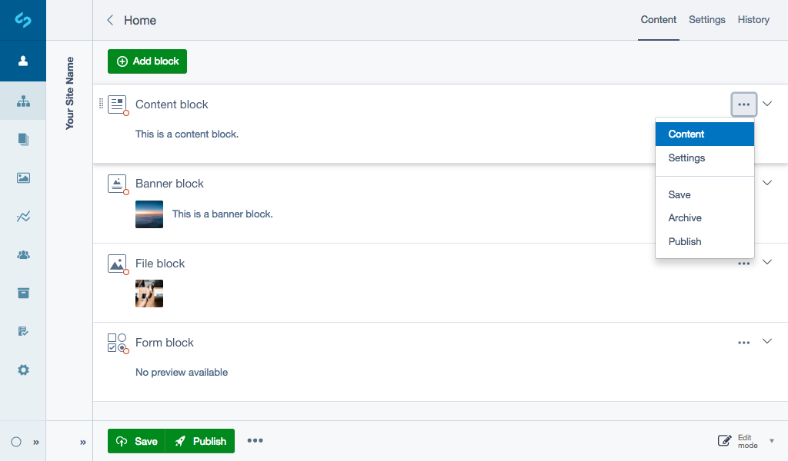

# Before we begin

To get started, create a new page in the CMS. See [Pages and content](https://userhelp.silverstripe.org/en/5/creating_pages_and_content/) to learn more.

## Creating and editing content {#creating-blocks}

Click the button ***Add block*** and select the type of block you want to create from the block selector. You'll see that content block types are also searchable on open. To remove your search click the link ***Clear***.

You'll see the content block type you selected appear in your main content area titled ***Untitled Content block***. If you forget the content block type you've added, hover on the block type icon to view a tooltip.

Most blocks are directly editable from within the page allowing you to have easy access adding and editing blocks without switching page views.

To edit, select the content block or click the ***Expand*** button shown as a dropdown arrow icon.

Enter your content as required, provide a title for the block and choose whether you want the title to be shown on the page or not via the ***Displayed*** checkbox field.

 The content block will remain open until collapsed or the page is reloaded. 

## Reordering content blocks {#reordering-blocks}

To change the order of content blocks in a page, simply click and hold anywhere on the block, then drag and release to reorder the item.

 Expanded blocks will collapse upon pick up.

When you release the block will automatically save their new positions, however you may need to publish the page to see the new order.

Similar to the reorganisation of pages, the state of a block is changed after it is relocated and a new version is created.

## Adding blocks between existing blocks {#adding-between-blocks}

An **Add block** button shown as a bar and plus icon can be activated by moving your cursor between blocks. You can select anywhere on the bar to open a block selector which will allow you to add a block between existing blocks.

## Block state indicators {#state-indicators}

States are shown on the block type icon as coloured indicators. Each represents the current workflow status your content block is in.

Orange full - The block state is **Draft** if the block has unsaved changes or it is not publicly visible.
Orange outline - The block is **Modified** where it has been published but has some additional draft changes.
No state - The block is published.

## More options {#more-options}

The ***More options*** dropdown shown as an ellipses icon provides further editing functionality of individual blocks including access to editing content, custom settings, saving, publishing and archiving.

### Editing existing blocks

When viewing a page, you can select the content block or select **Content** from the ***More options*** dropdown.

### Settings

Your developer may choose to add custom CSS classes allowing you to add theming to the front-end of specific blocks. Custom CSS classes can be added by selecting ***Settings*** from the ***More options*** dropdown.

In ***Settings*** your developer may also choose to add ***Style Variants*** to allow for different stylistic changes to adjust the appearance of content blocks. See [Style variants](https://github.com/silverstripe/silverstripe-elemental#style-variants) for more information.

### Saving and publishing content blocks

Pages with content blocks allow you to perform actions like publish at a page level, but you also have access to perform similar actions on individual blocks. Allowing the ability for blocks to be managed and edited by multiple CMS authors while remaining in draft while other blocks get published. This allows for more flexibility of individual blocks for example if a block has user permissions.

To save or publish an individual content block select the ***More options*** dropdown. To save or publish the whole page select from the Action toolbar of the CMS. See [Saving changes and publishing](https://userhelp.silverstripe.org/en/5/creating_pages_and_content/creating_and_editing_content/saving_changes_and_publishing/) for more information.

### Archiving blocks

To Archive a block select *Archive* in the ***More options*** dropdown. See [Archiving](https://userhelp.silverstripe.org/en/5/creating_pages_and_content/archive/) for more information.
