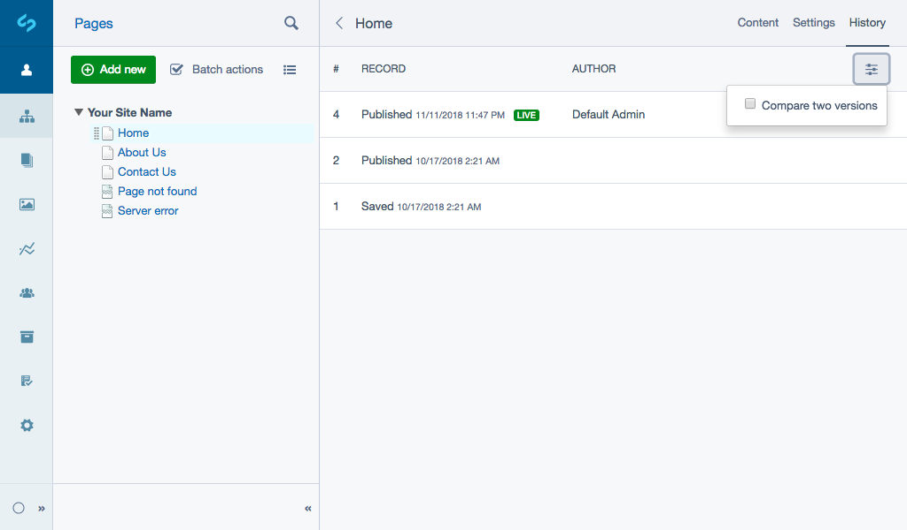
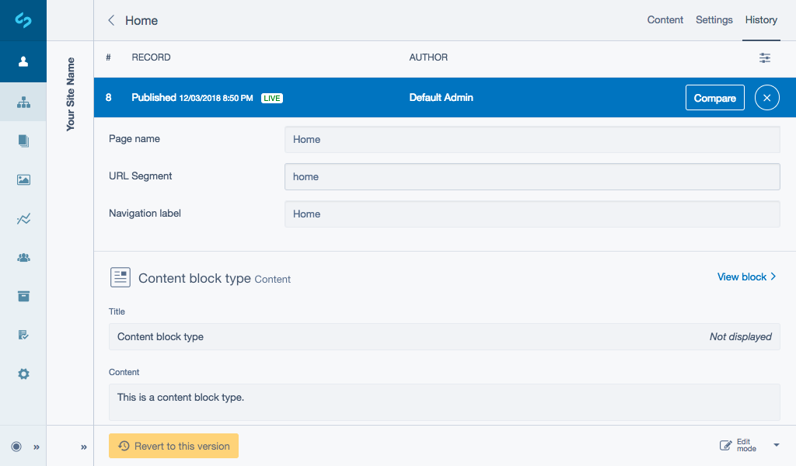

# Using history

[Pages history](https://userhelp.silverstripe.org/en/4/creating_pages_and_content/pages/rolling_back_pages/) includes content block history out of the box. Blocks have their own versioning and can be viewed as part of a pages **History**.

## Finding historic versions of content

Whenever you modify a block and save it, a new version of the block is created and the old version is saved in the history section of the CMS. You can view the older versions by navigating to the **History** tab of any block, which will show you a list of each version, the date it was modified or published and the user who actioned the change.

You can select a specific record to see a reference of what the content block looked like at that version.

## Rolling back to specific versions

If you want to revert a content block back to an old version, simply choose the record you want from the list and click the button ***Revert to this version*** in the bottom Action toolbar.

This will create a new draft version with its most recent content. You will need to publish the content block in order for it to show on the live version of the page.

## Compare mode

Navigate to the **History** tab. Similar to Pages see [Comparing snapshots](https://userhelp.silverstripe.org/en/4/creating_pages_and_content/pages/rolling_back_pages/#comparing-snapshots) to learn how to view what has changed between 2 different versions of a page.

When viewing a version, history has a few extra features Page history does not include:
* Select ***View block*** to take you to edit mode.
* The label ***Displayed*** represents if the ***Title*** of your content block is shown on the front-end of your website or not.
