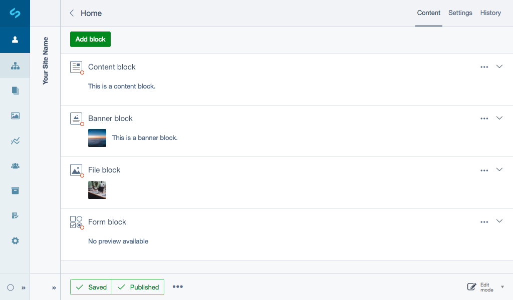

title: Content blocks
summary: Content blocks overview.

The Content blocks feature is new as of SilverStripe 4 and therefore will continue to develop with functionality.

# Content blocks overview

The [Elemental module](https://addons.silverstripe.org/add-ons/dnadesign/silverstripe-elemental) provides the ability for SilverStripe users to break up a web page into smaller modular parts (or ‘blocks’) that allow content like banners, text and media to be independently managed within the CMS. This also allows for more targeted control over individual types of content, as well as individual versioning, more detailed reports and easy customisation for developers over how certain pieces of content are presented.

## Before we begin

Make sure that your SilverStripe CMS installation has the [Elemental module](https://addons.silverstripe.org/add-ons/dnadesign/silverstripe-elemental) installed.

Developer knowledge is required to enable the functionality within the configuration before you begin.

## Using content blocks in the CMS

Normally in the CMS a page has an HTML editor which allows you to enter content directly. The block types shown in the popover action set will depend on your set up. By default the [Elemental module](https://github.com/dnadesign/silverstripe-elemental) only comes with the content block type, **Content**.

We’ve created the most functional and effective elements of content block modules that have been developed by the SilverStripe community and created four generic SilverStripe supported content block types:

* [Content:](https://github.com/dnadesign/silverstripe-elemental) text content (built-in).
* [Banner:](https://github.com/silverstripe/silverstripe-elemental-bannerblock) banner with call-to-action and content.
* [File:](https://github.com/silverstripe/silverstripe-elemental-fileblock) file and image block.
* [Form:](https://github.com/dnadesign/silverstripe-elemental-userforms) integrates [silverstripe-userforms](silverstripe/silverstripe-userforms) and provides a new content block, which can be used to create user defined forms.

For examples of community content blocks see,
[Getting more elements](https://github.com/dnadesign/silverstripe-elemental#getting-more-elements).

## Features

* [Creating and editing blocks](edit_content.md)
* [History and rollback to certain versions](history.md)
* [Reports](reports.md)
